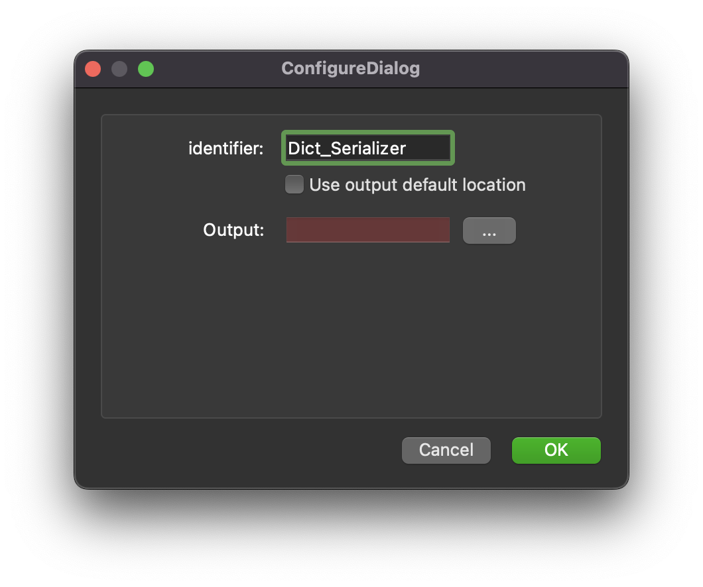

.. _mcp-dictserializer-configuration:

Configuration
-------------

This step is used for saving a Python dictionary on the local disk outside the workflow directory.
This step uses a *http://physiomeproject.org/workflow/1.0/rdf-schema#dict* and saves it in JSON format to a location on the local disk.
To choose the output location use the *...* button to open a file chooser dialog.
The *Output* input is used to hold the relative path from the workflow to the saved JSON file.

.. _fig-mcp-dict-serializer-configure-dialog:

   *Dict Serializer* step configuration dialog.

The *Use output default location* checkbox is *deprecated* and will be removed in a future release.