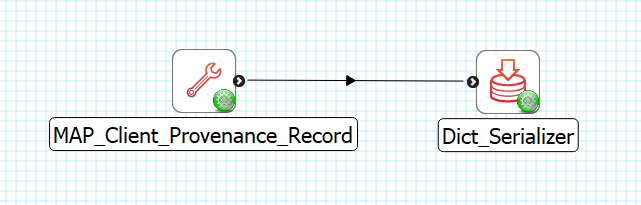
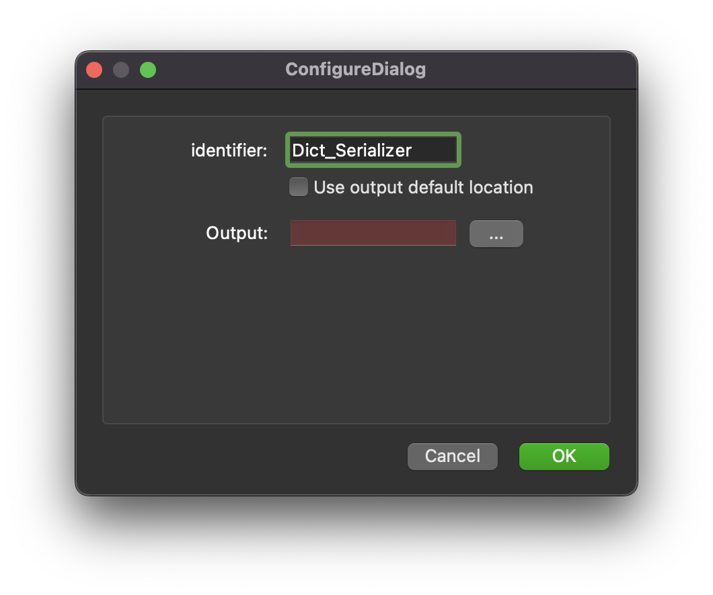

Dict Serializer
===============

Overview
--------
The **Dict Serializer** is MAP Client plugin for saving a Python dictionary to a location outside the workflow.

Workflow Connections
--------------------

As shown in :numref:`fig-mcp-dict-serializer-workflow-connections`, the **Dict Serializer** uses 1 input:

1. A Python dictionary from **MAP Client Provenance Record** or other plugin. (Port: *http://physiomeproject.org/workflow/1.0/rdf-schema#dict*) 

It does not have a output port, the output of this plugin will be generated in the folder set in config.

.. _fig-mcp-dict-serializer-workflow-connections:

   **Dict Serializer** workflow connections.

Configure
---------

This step is used for saving a Python dictionary on the local disk outside the workflow directory.
This step uses a *http://physiomeproject.org/workflow/1.0/rdf-schema#dict* and saves it in JSON format to a location on the local disk.
To choose the output location use the *...* button to open a file chooser dialog.
The *Output* input is used to hold the relative path from the workflow to the saved JSON file.

.. _fig-mcp-dict-serializer-configure-dialog:

   *Dict Serializer* step configuration dialog.

The *Use output default location* checkbox is *deprecated* and will be removed in a future release.
